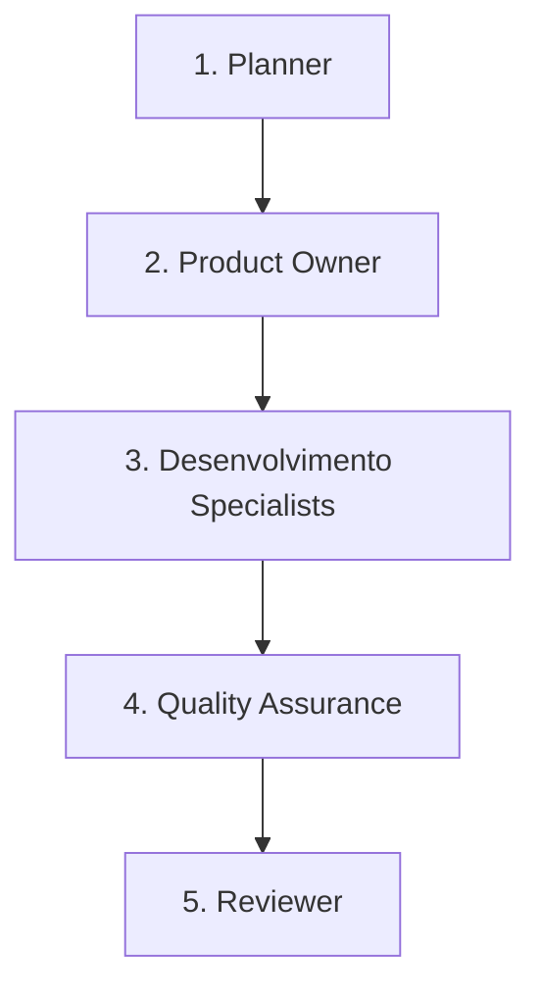

# Workflow: Bugfix

Este workflow é utilizado para a correção de falhas e bugs identificados no sistema em ambiente de desenvolvimento ou homologação.

## Pipeline de Transição de Fases

---

### Fase 1: Análise e Reprodução (Planner)
* **Ator**: `planner` (ou Orquestrador em modo Planner)
* **Gatilho de Entrada**: Relato de bug por parte do usuário ou erro em testes automatizados.
* **Critérios de Delegação**:
  - O orquestrador analisa os logs, o código relacionado e reproduz o erro localmente se necessário.
* **Gatilho de Saída**: Causa raiz identificada e plano de correção técnica proposto.

### Fase 2: Validação de Escopo (Product Owner - PO)
* **Ator**: `po` (Subagente Especialista)
* **Gatilho de Entrada**: Causa raiz identificada.
* **Critérios de Delegação**:
  - O orquestrador delega ao `po` para avaliar o impacto do bug nas regras de negócio e definir se a correção exige alterações nos critérios de aceitação existentes ou novas documentações.
* **Gatilho de Saída**: Alinhamento do impacto do bug e critérios de correção validados.

### Fase 3: Correção (Especialistas - Dev)
* **Ator**: `dev-back` e/ou `dev-front` (Subagentes Especialistas)
* **Gatilho de Entrada**: Impacto validado e estratégia de correção definida.
* **Critérios de Delegação**:
  - O orquestrador **DEVE** delegar a correção do bug ao especialista correspondente (`dev-back` para APIs, banco de dados ou backend; `dev-front` para interfaces, css ou frontend).
  - O desenvolvedor especialista deve criar um teste de regressão que falhe sem a correção e passe com a correção, garantindo que o erro não volte a acontecer.
* **Gatilho de Saída**: Bug corrigido e testes unitários/regressão passando localmente.

### Fase 4: Validação da Correção (Quality Assurance - QA)
* **Ator**: `qa` (Subagente Especialista)
* **Gatilho de Entrada**: Correção do bug concluída e entregue pelo Dev.
* **Critérios de Delegação**:
  - O orquestrador **DEVE** delegar a validação para o subagente `qa`.
  - O QA executa a suíte de testes de regressão e valida se a falha foi sanada sem que novos problemas fossem introduzidos.
* **Gatilho de Saída**: Validação de QA aprovada sem efeitos colaterais detectados.

### Fase 5: Revisão da Correção (Reviewer)
* **Ator**: `reviewer` (Subagente Especialista)
* **Gatilho de Entrada**: QA aprovado.
* **Critérios de Delegação**:
  - O orquestrador **DEVE** delegar a revisão para o `reviewer`.
  - O reviewer analisa se a correção foi feita de forma limpa, seguindo boas práticas e sem criar "gambiarras" ou brechas de segurança.
* **Gatilho de Saída**: Correção aprovada e pronta para merge/release.