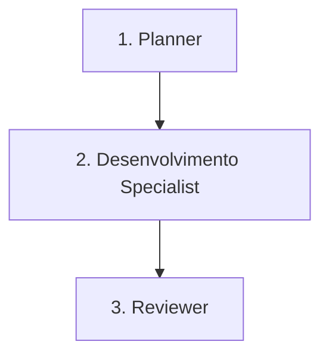

# Workflow: Hotfix

Este workflow é utilizado para correções críticas e urgentes diretamente em ambiente de produção (ex: indisponibilidade da API, vulnerabilidades de segurança expostas).

## Pipeline de Transição de Fases

---

### Fase 1: Diagnóstico Urgente (Planner)
* **Ator**: `planner` (ou Orquestrador em modo Planner)
* **Gatilho de Entrada**: Alerta urgente de falha crítica ou de segurança em produção.
* **Ações**:
  - O orquestrador diagnostica rapidamente a causa raiz analisando os logs de produção ou códigos do sistema.
* **Gatilho de Saída**: Diagnóstico de falha concluído e correção emergencial desenhada.

### Fase 2: Correção Rápida (Especialistas - Dev)
* **Ator**: `dev-back` ou `dev-front` (Subagente Especialista)
* **Gatilho de Entrada**: Plano de correção definido.
* **Critérios de Delegação**:
  - O orquestrador **DEVE** delegar a correção ao especialista responsável de imediato.
  - O desenvolvedor executa a correção emergencial e valida localmente com a maior cobertura de testes possível sob o tempo restrito.
* **Gatilho de Saída**: Correção emergencial aplicada e validada localmente.

### Fase 3: Revisão Emergencial (Reviewer)
* **Ator**: `reviewer` (Subagente Especialista)
* **Gatilho de Entrada**: Correção enviada para revisão.
* **Critérios de Delegação**:
  - O orquestrador **DEVE** delegar ao subagente `reviewer` para uma revisão expressa mas rigorosa da correção, garantindo que o patch resolve a falha sem expor novos vetores de ataque ou falhas graves.
* **Gatilho de Saída**: Aprovação do Reviewer para implantação imediata em produção.