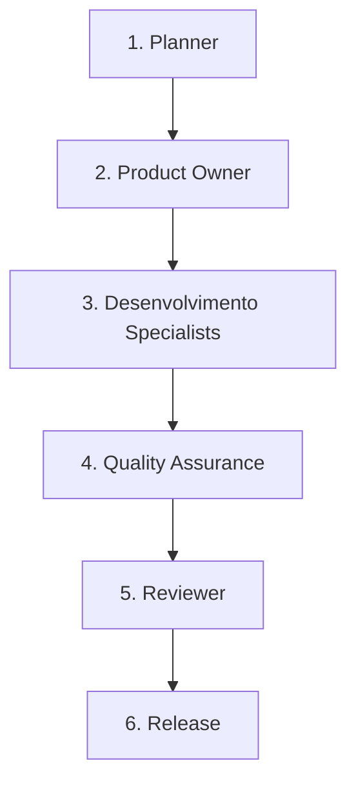

# Workflow: New Feature

Este workflow é utilizado para a criação e desenvolvimento de novas funcionalidades no ecossistema do Meu Correspondente.

## Pipeline de Transição de Fases

---

### Fase 1: Planejamento (Planner)
* **Ator**: `planner` (ou Orquestrador em modo Planner)
* **Gatilho de Entrada**: Solicitação do usuário para nova feature.
* **Critérios de Delegação**:
  - O orquestrador assume o papel de `planner` ou delega a um subagente de planejamento para mapear os arquivos e desenhar a estratégia técnica geral.
* **Gatilho de Saída**: Plano técnico macro aprovado pelo usuário.

### Fase 2: Detalhamento de Requisitos (Product Owner - PO)
* **Ator**: `po` (Subagente Especialista)
* **Gatilho de Entrada**: Plano técnico aprovado.
* **Critérios de Delegação**:
  - O orquestrador **DEVE** delegar esta fase ao subagente `po`.
  - O PO analisa as especificações, regras de negócios e cria/atualiza os documentos de especificação funcional (ex: `admin_spec.md`) e detalha os critérios de aceitação.
* **Gatilho de Saída**: Especificação técnica funcional aprovada pelo usuário.

### Fase 3: Desenvolvimento (Especialistas - Dev)
* **Ator**: `dev-back` (Backend) e/ou `dev-front` (Frontend) (Subagentes Especialistas)
* **Gatilho de Entrada**: Especificação técnica aprovada.
* **Critérios de Delegação**:
  - O orquestrador **NUNCA** deve codificar diretamente. Ele **DEVE** delegar a implementação para:
    - `dev-back`: Rotas, controladores, acesso ao banco de dados (Prisma), lógica de negócios backend e testes unitários/integração de API.
    - `dev-front`: Telas estáticas, componentes de interface, estilos (Tailwind CSS, Vanilla CSS) e lógica de tela no frontend.
* **Gatilho de Saída**: Código implementado, testes locais aprovados e arquivos modificados reportados.

### Fase 4: Garantia de Qualidade (Quality Assurance - QA)
* **Ator**: `qa` (Subagente Especialista)
* **Gatilho de Entrada**: Implementação concluída pelo Dev.
* **Critérios de Delegação**:
  - O orquestrador **DEVE** delegar para o subagente `qa`.
  - O QA valida os cenários criados, executa testes de fumaça, testes unitários, testes de integração e valida possíveis regressões.
* **Gatilho de Saída**: Relatório de QA sem bugs críticos ou bloqueantes e todos os testes 100% aprovados.

### Fase 5: Revisão de Código (Reviewer)
* **Ator**: `reviewer` (Subagente Especialista)
* **Gatilho de Entrada**: QA aprovado.
* **Critérios de Delegação**:
  - O orquestrador **DEVE** delegar para o subagente `reviewer`.
  - O reviewer analisa a qualidade estática do código, aderência aos padrões de arquitetura e boas práticas de segurança/otimização.
* **Gatilho de Saída**: Código aprovado sem "blockers".

### Fase 6: Entrega e Release
* **Ator**: `release` (ou Orquestrador em modo Release)
* **Gatilho de Entrada**: Código revisado e aprovado.
* **Ações**: Mesclar branch (se houver), rodar seed, atualizar logs de changelog e finalizar a tarefa.
* **Gatilho de Saída**: Notificação de conclusão enviada com sucesso para o usuário.