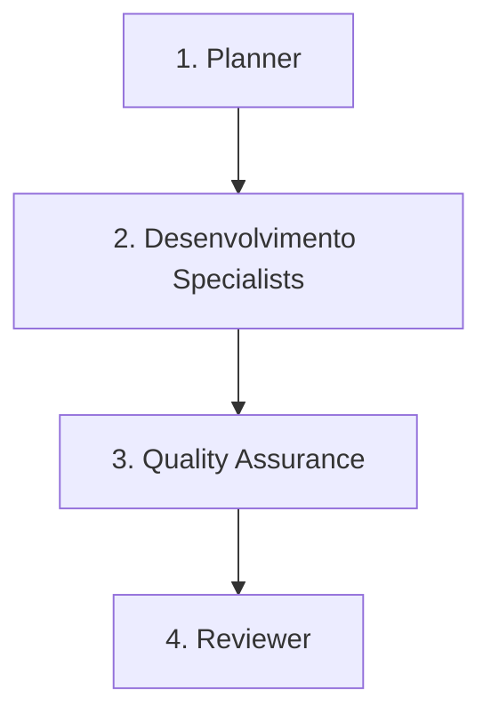

# Workflow: Refactor

Este workflow é utilizado para a reestruturação e melhoria da qualidade interna do código (limpeza de código, performance, redução de débito técnico) sem alterar o comportamento externo do sistema.

## Pipeline de Transição de Fases

---

### Fase 1: Análise de Débito Técnico (Planner)
* **Ator**: `planner` (ou Orquestrador em modo Planner)
* **Gatilho de Entrada**: Necessidade de melhoria arquitetural ou refatoração de algum componente.
* **Ações**:
  - Identificar os componentes/arquivos a serem refatorados.
  - Mapear a cobertura de testes atual dos arquivos afetados. Se a cobertura for baixa, criar testes antes de iniciar a refatoração.
* **Gatilho de Saída**: Plano de refatoração definido com segurança (mapeamento de testes de regressão).

### Fase 2: Execução da Refatoração (Especialistas - Dev)
* **Ator**: `dev-back` e/ou `dev-front` (Subagentes Especialistas)
* **Gatilho de Entrada**: Plano de refatoração e testes de segurança mapeados.
* **Critérios de Delegação**:
  - O orquestrador **DEVE** delegar a refatoração aos subagentes especialistas (`dev-back` e/ou `dev-front`).
  - O especialista aplica as melhorias de código mantendo a compatibilidade e a funcionalidade anterior.
* **Gatilho de Saída**: Código refatorado e suite de testes passando localmente sem alterações de testes quebradas.

### Fase 3: Homologação e Regressão (Quality Assurance - QA)
* **Ator**: `qa` (Subagente Especialista)
* **Gatilho de Entrada**: Refatoração concluída pelo Dev.
* **Critérios de Delegação**:
  - O orquestrador **DEVE** delegar a validação ao subagente `qa`.
  - O QA realiza testes de regressão estritos para garantir que nenhuma funcionalidade existente foi quebrada com a refatoração.
* **Gatilho de Saída**: Relatório de regressão de QA aprovado sem erros de funcionalidade quebrada.

### Fase 4: Revisão de Estrutura (Reviewer)
* **Ator**: `reviewer` (Subagente Especialista)
* **Gatilho de Entrada**: Testes de regressão aprovados.
* **Critérios de Delegação**:
  - O orquestrador **DEVE** delegar a revisão ao subagente `reviewer`.
  - O reviewer valida se as alterações melhoraram a legibilidade, a arquitetura e removeram com sucesso o débito técnico pretendido.
* **Gatilho de Saída**: Aprovação do Reviewer para consolidação do código.