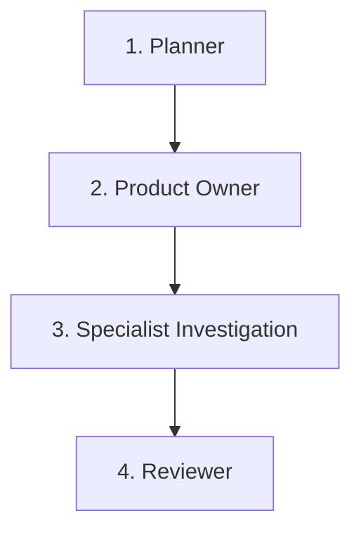

# Workflow: Spike (Exploração Técnica)

Este workflow é utilizado para investigações técnicas, prototipação rápida, prova de conceito (PoC) ou resolução de incertezas de arquitetura antes de iniciar o desenvolvimento de uma feature complexa.

## Pipeline de Transição de Fases

---

### Fase 1: Formulação da Incerteza (Planner)
* **Ator**: `planner` (ou Orquestrador em modo Planner)
* **Gatilho de Entrada**: Dúvida ou impedimento técnico para implementação de uma feature.
* **Ações**: Mapeia as perguntas que precisam ser respondidas (ex: performance de biblioteca, viabilidade de API externa, comportamento de framework).
* **Gatilho de Saída**: Lista de perguntas/objetivos do Spike aprovados pelo usuário.

### Fase 2: Definição de Escopo e Time-box (Product Owner - PO)
* **Ator**: `po` (Subagente Especialista)
* **Gatilho de Entrada**: Perguntas do Spike formuladas.
* **Critérios de Delegação**:
  - O orquestrador delega ao `po` para estabelecer limites claros de tempo (Time-box) e definir quais entregáveis são esperados (ex: documento de arquitetura, protótipo de código descartável, análise de custo).
* **Gatilho de Saída**: Definição do escopo e limites do Spike aprovados.

### Fase 3: Investigação e Prototipação (Especialistas - Dev)
* **Ator**: `dev-back` ou `dev-front` ou arquiteto (Subagente Especialista)
* **Gatilho de Entrada**: Escopo e limites definidos.
* **Critérios de Delegação**:
  - O orquestrador delega a investigação ao especialista adequado.
  - O especialista cria códigos descartáveis para testes rápidos, lê documentações de APIs externas e analisa possíveis soluções de mercado.
* **Gatilho de Saída**: Entrega dos protótipos descartáveis e elaboração de um relatório/documento de conclusões técnicas.

### Fase 4: Revisão de Recomendações (Reviewer)
* **Ator**: `reviewer` (Subagente Especialista)
* **Gatilho de Entrada**: Relatório técnico entregue.
* **Critérios de Delegação**:
  - O orquestrador delega ao `reviewer` para validar o relatório técnico e a arquitetura proposta no Spike.
* **Gatilho de Saída**: Recomendação técnica aprovada, fechamento do Spike e criação dos planos de tarefas subsequentes (para o workflow de New Feature).