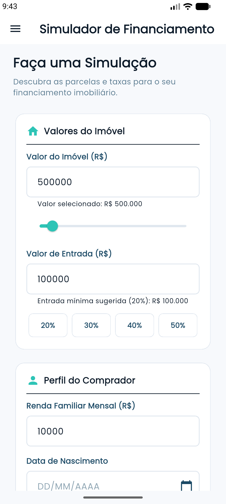
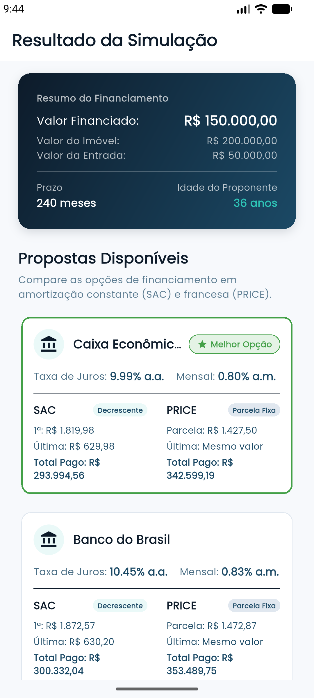
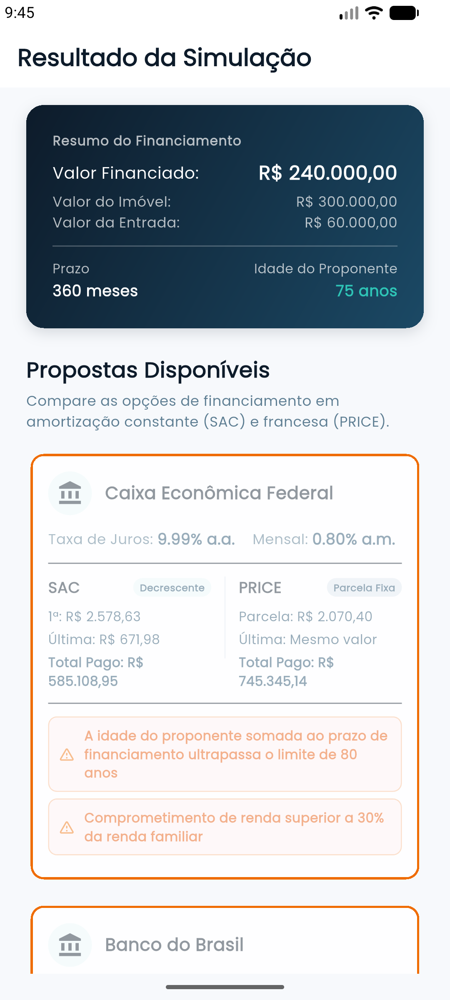

# Relatório de QA - Testes Integrados (Issue #10)

**Projeto:** Meu Correspondente  
**Status do Teste:** **APROVADO**  
**Data:** 05/07/2026  
**Responsável:** QA (Quality Assurance)  

---

## 1. Objetivo
Este documento apresenta o resultado dos testes integrados de validação geral do aplicativo **Meu Correspondente** rodando no emulador Android e comunicando-se com a API executada via Docker Compose. O foco foi validar os principais fluxos de tela e as regras de negócio de simulação e autenticação integradas.

---

## 2. Ambiente de Teste
- **Backend:** API Node.js / Express com Prisma ORM executada via Docker Compose (`db` em PostgreSQL + `api`).
- **Banco de Dados:** Semeado automaticamente com instituições financeiras e taxas de juros padrão (Caixa Econômica Federal, Banco do Brasil, Itaú).
- **Frontend:** Aplicativo Flutter rodando em emulador Android (`emulator-5554`, Android 17 / API 37).
- **Conectividade:** Aplicativo configurado para apontar para `http://10.0.2.2:3000` (IP de loopback do host no emulador Android).

---

## 3. Cenários de Teste e Evidências

### Cenário 1: Tela de Login (Acesso do Usuário)
- **Descrição:** Validação da interface inicial de autenticação do usuário.
- **Evidência:**
  

### Cenário 2: Formulário do Simulador
- **Descrição:** Validação da tela de entrada de dados para simulação habitacional, com os campos para valor do imóvel, entrada, renda familiar e prazo.
- **Evidência:**
  

### Cenário 3: Resultado de Simulação - Fluxo Feliz (Sucesso)
- **Descrição:** Simulação com dados simulados dentro dos limites operacionais dos bancos:
  - Valor do Imóvel: R$ 200.000,00
  - Entrada: R$ 50.000,00
  - Renda Mensal: R$ 8.000,00
  - Prazo: 240 meses (20 anos)
  - Data de Nascimento: 15/05/1990 (Idade: 36 anos)
- **Resultado:** Retorno com sucesso das taxas das instituições sem nenhuma restrição crítica.
- **Evidência:**
  

### Cenário 4: Resultado de Simulação - Fluxo com Restrições / Alertas
- **Descrição:** Simulação enviando parâmetros que extrapolam limites de crédito ou idade:
  - Valor do Imóvel: R$ 300.000,00
  - Entrada: R$ 60.000,00
  - Renda Mensal: R$ 1.500,00 (Gera alerta de comprometimento de renda > 30%)
  - Prazo: 360 meses (30 anos)
  - Data de Nascimento: 01/01/1951 (Idade: 75 anos. Gera alerta de estouro do limite de idade: 75 + 30 = 105 anos > 80 anos)
- **Resultado:** A interface exibe corretamente os alertas de restrição gerados pelas regras de negócios da API.
- **Evidência:**
  

---

## 4. Conclusão
A integração ponta a ponta entre o aplicativo Flutter e a API em Docker funcionou perfeitamente. 
- O aplicativo consumiu com sucesso os endpoints `/api/simulate` e obteve as taxas e restrições corretas de acordo com a lógica programada no backend.
- O banco de dados foi semeado de forma íntegra e os containers subiram e desligaram corretamente.
- O ponto de entrada `main.dart` foi devidamente restaurado para `home: const AuthWrapper()`.

**Status de QA:** **APROVADO**
